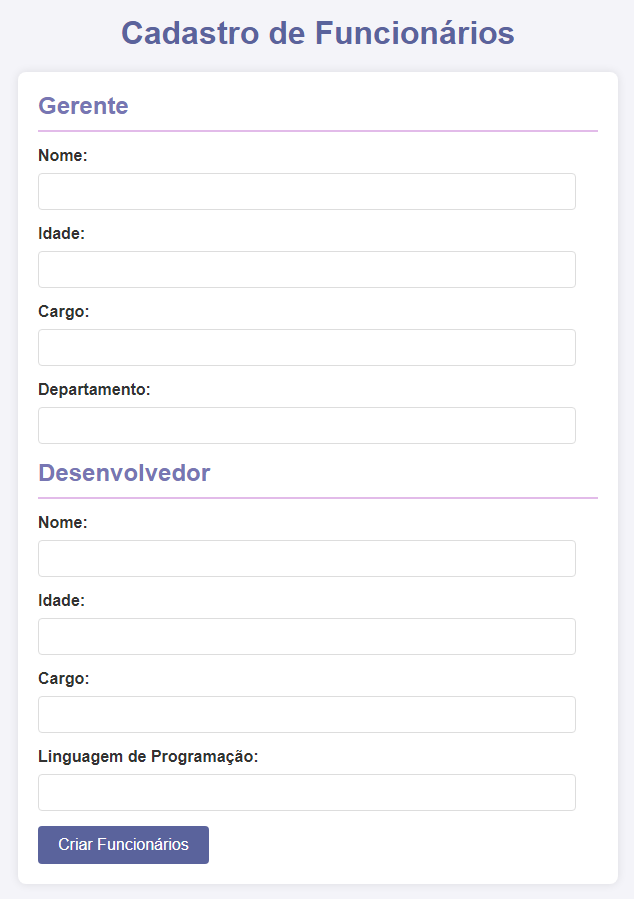

    

    Projeto desenvolvido para atividade da gradução

## 👩‍💻  Tecnologias utilizadas
⤷ JavaScript 
⤷ HTML 
⤷ CSS

## 🖥️ Projeto
⤷ O projeto é um sistema para gerenciar diferentes tipos de funcionários em uma empresa, utilizando HTML, CSS e JavaScript. A aplicação permite o cadastro de dois tipos de funcionários: gerentes e desenvolvedores. O formulário HTML coleta informações como nome, idade, cargo, departamento (para gerentes) e linguagem de programação (para desenvolvedores).

    
    

 

    

    ©2024 by Ana Luiza Seidel

